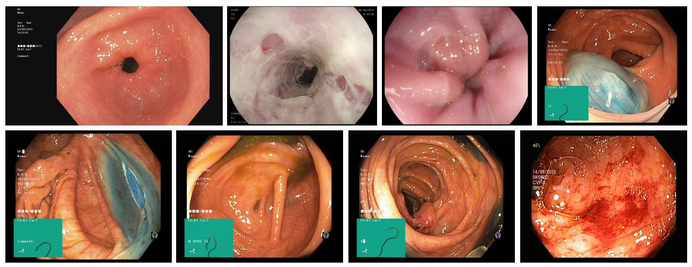

# Covolutional Neural Network for gastrointestinal disease multi class classification.

The aim of this repository is identify and classify 8 different types of images of gastrointestinal medical dataset. 

### The classes for classification:
- Dyed and lifted polyps;
- Dyed resection margins;
- Esophagits;
- Normal cecum;
- Normal pylorus;
- Normal z-line;
- Polyps;
- Ulcerative colits.

The figure bellow shows an example of the dataset
#### Dataset example:

### Prerequisites
A prerequisite is the previous installation of the follow libraries in the Python environment that the code is being run.

Libraries:
- Keras
- Tensorflow 
- Numpy

## TO DO
 First of all download the dataset at (https://datasets.simula.no/kvasir/). For this code, the dataset "Kvasir Dataset v2" was used. Then create two separate folders (one for testing and another one from training) with all the eigth classes inside both of them. Divide the total dataset in 80% for training and 20% for testing. 
 
 Once the datset is separated, the code xcnn_gd can be run for training and validating the model. If the desired accuracy is obtained, the model can be saved and used. Nevertheless, this repository already contains a saved model ('model.h5') already trained and ready for classifying with a validation accuracy of .
